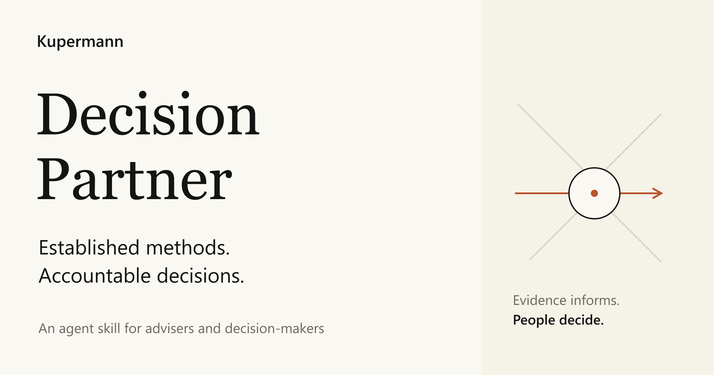
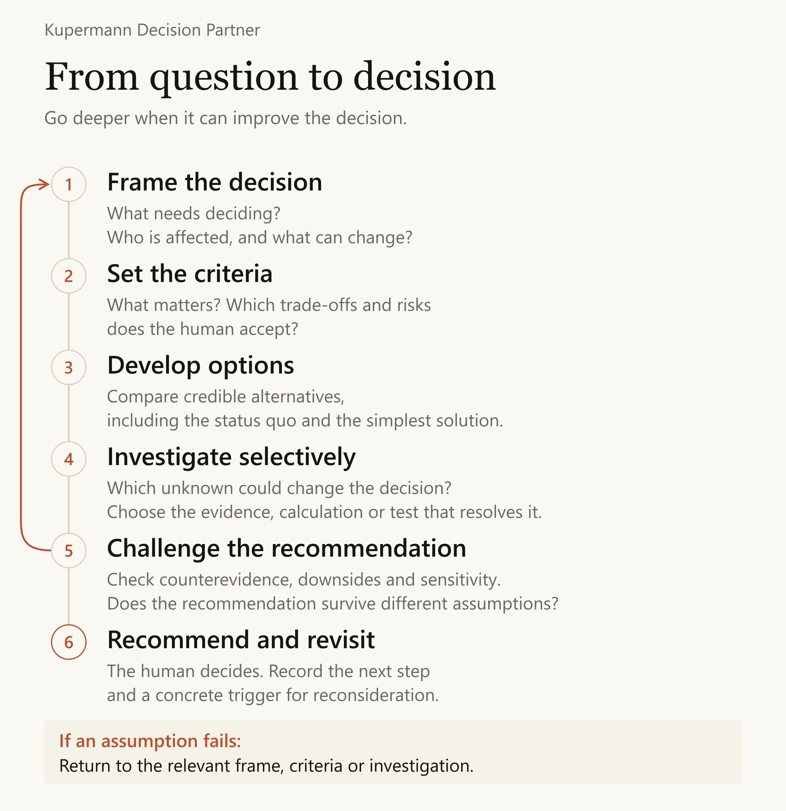

# Kupermann Decision Partner

An agent skill for advisers and decision-makers who need a recommendation they can examine, challenge and revisit.

The skill brings established problem-solving methods into one proportionate workflow. It helps an agent clarify a decision, compare options, test material assumptions and produce a concise decision brief. The person retains ownership of goals, value judgments and the final decision.

**By Michael Kupermann · Version 0.1.0 · MIT**

[Read the skill](skills/kupermann-decision-partner/SKILL.md) · [Worked example](docs/worked-example.md) · [Research and provenance](skills/kupermann-decision-partner/references/research-and-provenance.md) · [Evaluation](docs/evaluation.md)

Read the accompanying essay: [English](https://kupermann.com/en/insights/decision-partner.html) · [Deutsch](https://kupermann.com/de/insights/decision-partner.html).

## The problem it addresses

A polished recommendation can conceal an incomplete problem definition, an unsupported assumption or a preference nobody agreed to. More text does not resolve those weaknesses. A useful advisory process makes them visible early enough to change the decision.

Decision Partner makes the question, the evidence and the authority to decide explicit. It adapts the depth of the work to its consequences. A reversible agenda change should still take a few sentences. A rollout decision deserves a record of its assumptions and a clear reason to revisit it.

## One workflow, selected methods



The structure draws on George Pólya's _How to Solve It_ (1945). Depending on the problem, the skill uses decomposition, an options comparison, a suitable evidence check, sensitivity analysis or a prospective failure analysis. It does not run every method on every task.

| The agent helps with | The decision-maker owns |
|---|---|
| Framing questions and making assumptions visible | Goals and the actual decision to be made |
| Research, calculations and option development | Material preferences and value trade-offs |
| Challenges, counterexamples and sensitivity checks | Acceptable risk and delegated authority |
| A concise, revisitable recommendation | The decision and its consequences |

[See the responsibility diagram](docs/figures/responsibilities.en.svg).

## Try a real decision

After installation, ask your agent:

```text
Use kupermann-decision-partner to assess whether we should expand this pilot.
Use the attached evidence. Separate observations from assumptions, show the
strongest alternative, and give me a short recommendation with the information
that would change it. Ask only about missing points that matter to the choice.
```

The [worked example](docs/worked-example.md) follows a fictional support-drafting pilot. It shows why a reported time saving, review overhead and a financial benefit are three different things. Every figure is illustrative and the arithmetic is reproducible.


## Install the skill

Clone the repository and copy **only** `skills/kupermann-decision-partner` into your agent's skills directory. Keep its `references`, `assets` and `agents` subdirectories together. The skill has no mandatory packages, credentials, hooks or external services.

For a project using Codex, from that project's root:

```bash
git clone https://github.com/mkupermann/kupermann-decision-partner.git
mkdir -p .agents/skills
test ! -e .agents/skills/kupermann-decision-partner && \
  cp -R kupermann-decision-partner/skills/kupermann-decision-partner .agents/skills/
```

PowerShell equivalent:

```powershell
git clone https://github.com/mkupermann/kupermann-decision-partner.git
$target = Join-Path (Get-Location) '.agents/skills/kupermann-decision-partner'
if (Test-Path -LiteralPath $target) { throw 'The skill already exists. Review it before updating.' }
New-Item -ItemType Directory -Force -Path '.agents/skills' | Out-Null
Copy-Item -LiteralPath 'kupermann-decision-partner/skills/kupermann-decision-partner' -Destination $target -Recurse
```

Start a new agent session after installation. In Codex, invoke `$kupermann-decision-partner`. For Claude Code, use the project's `.claude/skills/` directory and invoke `/kupermann-decision-partner`. Other clients must support the [Agent Skills format](https://agentskills.io/specification); this release does not claim that every client has been tested.

The Markdown files can also be read and used directly. Tools and permissions come from the host agent. The skill does not grant authority to contact people, spend money or publish a proposed decision.

## Research-informed, with explicit limits

The design credits Pólya and research on cognitive offloading, critical thinking, overreliance and learning. The [source notes](skills/kupermann-decision-partner/references/research-and-provenance.md) distinguish a review, a survey and controlled experiments, and explain their limits.

Those sources do not validate this particular skill. It does not guarantee correct answers, prevent hallucinations or establish that a person has retained understanding. The [evaluation record](docs/evaluation.md) separates development checks from the human and comparative studies that would be needed for stronger claims.

## Repository guide

| Path | Purpose |
|---|---|
| `skills/kupermann-decision-partner/` | The complete installable skill |
| `docs/worked-example.md` | An end-to-end fictional advisory case |
| `docs/evaluation.md` | What was checked and what remains unknown |
| `docs/figures/` | Editable SVGs and high-resolution PNGs |
| `evals/` | Cases, review criteria and recorded development outputs |
| `scripts/check_repository.py` | Dependency-free integrity and arithmetic checks |

Run `python scripts/check_repository.py` from the repository root. This checks packaging, local links, graphics metadata and the example's calculations. It cannot judge whether a recommendation is sensible.

## Contributing

Useful contributions show a concrete case where the skill chooses the wrong method, hides an assumption, interrupts unnecessarily or gives unjustified confidence. Use fictional or publishable data, retain the original prompt and response, and explain the practical consequence. New rules should address observed problems without adding ceremony to unrelated tasks.

## Author and licence

Michael Kupermann · [kupermann.com](https://kupermann.com) · [Kupermann Agent Skills](https://github.com/mkupermann/KupermannAgentSkills)

Original instructions, documentation and graphics are released under the [MIT licence](LICENSE). Referenced books and studies remain under their respective rights. Their authors and publishers do not endorse this project.
