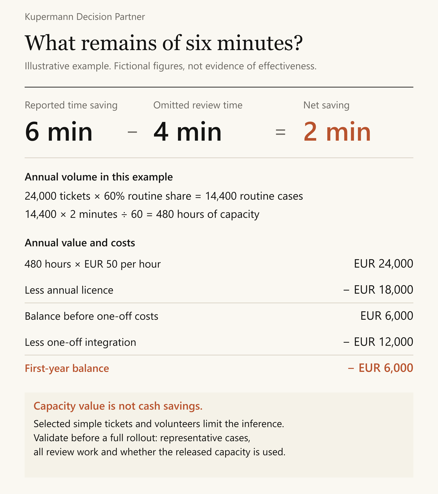

# A support pilot that looks stronger than its evidence

**Fictional teaching case.** The organisation, observations and amounts below are invented to make the reasoning inspectable. This is not a client result or a performance claim.

## The request

A sponsor wants a board recommendation to expand a support-drafting pilot. Eight experienced volunteers selected 80 routine tickets. They reported an average saving of six minutes per ticket. Four additional minutes of draft review were not counted in that saving.

The support team handles 24,000 tickets annually. Sixty per cent are routine. The loaded staff rate is EUR 50 per hour. The proposed licence costs EUR 18,000 per year and integration costs EUR 12,000 once. Reviewers caught two drafts with an incorrect cancellation term. Complex cases have not been tested. Management wants 30% better productivity, without a defined measurement or quality threshold.

## 1. Frame the choice

The decision is whether to commit to a full rollout, run a focused validation, or retain the current process. The sponsor's preferred answer is a stakeholder position, not evidence that the rollout meets the organisation's needs.

The board or its delegated owner must set the investment horizon and acceptable quality. The adviser can prepare options and a validation design. Preparation does not authorise new spending or a trial involving live customers.

## 2. Make the economic comparison explicit

| Calculation | Result | What it means |
|---|---:|---|
| 6 reported minutes less 4 review minutes | 2 minutes | Net time released per observed routine ticket |
| 24,000 annual tickets × 60% routine | 14,400 tickets | Potential annual routine-ticket population |
| 14,400 × 2 ÷ 60 | 480 hours | Annual released capacity if the result transfers |
| 480 × EUR 50 | EUR 24,000 | Valuation of that capacity at the supplied staff rate |
| EUR 24,000 less EUR 18,000 licence | EUR 6,000 | Recurring net capacity value before other costs |
| EUR 6,000 less EUR 12,000 integration | **EUR −6,000** | First-year net capacity value under these assumptions |

Released capacity is not cash. The organisation must identify useful redeployment or an actual reduction in expenditure before treating it as realised financial benefit. Training, maintenance and additional rework are not quantified here. The negative first-year result is therefore not a complete business case, and the positive recurring result is conditional.

With the supplied volume and rate, the recurring licence alone requires **1.5 net minutes** per routine ticket to break even. Licence plus first-year integration requires **2.5 net minutes**. Those are arithmetic boundaries under the stated assumptions, not recommended approval thresholds. A different decision horizon may change the choice.

## 3. Ask what the pilot can establish

The observed workflow produced some time savings while reviewers caught two specific errors. It does not establish the performance of complex tickets, adoption by the wider team or a future rate of undetected errors. Experienced volunteers selecting their own work are a narrow sample. A 30% productivity claim cannot be assessed without the baseline time and a definition of productivity.

The next useful evidence is not another general opinion about AI. It is a comparable measurement of net time, final-answer quality and actual adoption across a relevant mix of staff and routine tickets.

## 4. Challenge the proposed rollout

The strongest case for expansion is that recurring capacity value may exceed the licence after initial integration, and a longer horizon could support investment. The strongest alternative is a bounded validation that resolves the uncertainty before a wider commitment. Keeping the current process is appropriate if even that investigation costs more than the decision is worth.

A credible failure path is that less experienced users need more review and still miss mistakes. That would weaken both economics and quality. Another is that released minutes cannot be redeployed, leaving the capacity estimate without an operational benefit.

## 5. The decision brief

**Recommendation:** Defer full rollout. Prepare a focused validation of routine tickets for the authorised owner to consider. Keep complex cases outside the proposed initial scope.

**Basis:** At the observed net saving, recurring net capacity value is EUR 6,000 before unmeasured costs, with a EUR 6,000 first-year shortfall. Representativeness, quality tolerance and the actual use of released capacity remain unresolved.

**Strongest alternative:** A longer-horizon rollout may be justified if representative results, accepted quality and credible redeployment support it. A preference for a fast rollout does not establish those conditions.

**Uncertainty:** High for a full rollout recommendation. The arithmetic is straightforward; the transfer from selected pilot tickets to normal operations is not established.

**What would change the recommendation:** Representative net savings and final-answer quality meeting criteria agreed before validation, plus a credible use for the released capacity over an accepted investment horizon. The owner must supply or approve the thresholds. If realistic savings cannot cover cost, the case for expansion weakens further.

**Next action:** The sponsor and operations lead define the quality constraint, decision horizon and permitted validation effort. The adviser prepares a design measuring baseline work, review and rework consistently. No new trial or purchase is implied by this document.

**Review event:** Reconsider the recommendation when that evidence is available, or earlier if pricing, scope or mandatory review requirements change. Record the original assumptions before revising the brief.

The useful output is the recommendation together with the reasons it should survive scrutiny and the evidence that could overturn it.
